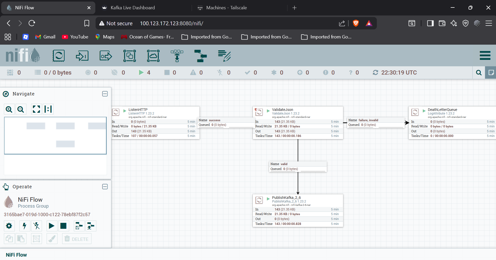
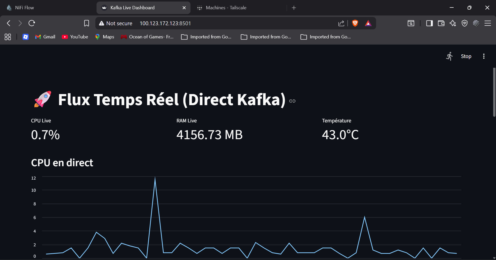

# Real-Time Edge-to-NoSQL IoT Pipeline


## 🎥 Live Demo

<video src="https://github.com/user-attachments/assets/b9ccb004-2173-44c8-993e-5db11fe07675" controls="controls" style="max-width: 100%;">
</video>

*Watch the pipeline in action: The Edge PC (Debian 13) streams telemetry data in real-time, traversing the secure Tailscale VPN to the AWS EC2 environment. The data is instantly processed via Kafka and NiFi, persisted into Cassandra, and visualized on the live Streamlit dashboard!*

## 📌 Overview
The **Real-Time Edge-to-NoSQL IoT Pipeline** is a fully automated, Cloud-deployed (AWS) data engineering architecture designed specifically for Edge Computing. It demonstrates a highly resilient, low-latency stream processing pipeline that securely ingests high-velocity hardware telemetry data from a remote edge device into a robust distributed storage and visualization layer hosted on an AWS EC2 instance.

This project serves as a comprehensive Data Engineering portfolio piece, highlighting expertise in cloud infrastructure, zero-trust networking, stream buffering, event-driven architecture, NoSQL data modeling, and automated GitOps (CI/CD) pipelines.

## 🏗️ Architecture


The pipeline processes real-time metrics (CPU usage, RAM availability, and Temperature) at 0.5-second intervals. The entire core infrastructure runs as a containerized stack on an **AWS EC2 instance (`m7i-flex.large`)**, chosen for its Free Tier eligibility and solid performance. The data flow is structured as follows:

1. **Edge Device (Hardware):** A Debian 13 edge node runs a Python telemetry agent (`edge/edge_agent.py`), capturing hardware metrics.
2. **Secure Network Layer:** **Tailscale VPN** creates a secure, zero-trust tunnel between the edge device and the AWS EC2 instance. Instead of exposing the EC2's public IP, the edge agent sends HTTP POST requests directly to the EC2's internal Tailscale IP (`100.x.x.x`) on port 9999.
3. **Continuous Deployment (CI/CD):** A fully automated GitOps pipeline using **GitHub Actions** triggers on every push to the `main` branch. It SSHs into the EC2 instance via port 22 (`0.0.0.0/0` in the Security Group) and automatically runs `docker compose up -d --build`.
4. **Ingestion Layer:** **Apache NiFi** receives the HTTP requests, routes the data, validates the schema, and streams the payload to the message broker.
5. **Streaming/Broker Layer:** **Apache Kafka** (running in KRaft mode) buffers the high-throughput events under the `test-iot` topic.
6. **Processing & Storage Layer:** *Note: While the high-level architecture diagram shows a direct line from Kafka to Cassandra, there is a custom Python consumer script (`processors/kafka_to_cassandra.py`) running in a Docker container.* This consumer retrieves events from Kafka, applies necessary transformations, and continuously persists the time-series data into **Apache Cassandra**.
7. **Visualization Layer:** A live **Streamlit** dashboard (`dashboard/dashboard.py`) consumes metrics directly from Kafka to render real-time, animated analytical charts.

---

## 🛠️ Prerequisites

Ensure the following are installed and configured:

- An **AWS Account** with an active `m7i-flex.large` EC2 instance.
- **Docker** and **Docker Compose** installed on the EC2 instance.
- A **Tailscale** account configured on both the edge device and the EC2 instance.
- A **GitHub Account** for CI/CD Secrets management.
- **Python 3.x** installed on the edge device.

---

## 🚀 Quick Start / How to Run

Follow these steps to deploy the data pipeline to AWS:

### Step 1: Configure GitHub Actions (CI/CD)
The repository uses an automated GitOps pipeline. Navigate to your repository's **Settings > Secrets and variables > Actions** and add the following repository secrets:
- `EC2_HOST`: The public IP or DNS of your AWS EC2 instance.
- `EC2_USERNAME`: Usually `ubuntu` or `ec2-user`.
- `EC2_SSH_KEY`: The private SSH key `.pem` content used to access the instance.

Once configured, any `push` to the `main` branch will automatically trigger GitHub Actions to SSH into the instance, pull the latest code, and execute `docker compose up -d --build`.

### Step 2: Configure Apache NiFi on AWS
1. Navigate to the NiFi Web UI using your EC2's Tailscale IP: `http://<EC2-TAILSCALE-IP>:8080/nifi`.
2. Default Credentials (unless modified in your `docker-compose.yml`):
   - **Username:** `admin`
   - **Password:** `supersecretpassword123`
3. Upload the pre-built NiFi flow template:
   - Go to the **Process Group** grid.
   - Click the **Upload Template** icon and select the `nifi/iot-nifi-template.xml` file.
4. Drag and drop the instantiated template onto the canvas and start all processors to begin listening for incoming HTTP payloads.



### Step 3: Start the Edge Telemetry Agent
On your Debian 13 edge device, connect to the Tailscale network and update your `edge_agent.py` script to point to the EC2's Tailscale IP (`100.x.x.x:9999`). 
```bash
# Install dependencies
pip install -r requirements.txt

# Run the agent
python3 edge/edge_agent.py
```

### Step 4: View the Live Dashboard
With data flowing securely from the edge to the AWS-hosted broker, open the Streamlit visualization app in your browser via the Tailscale VPN:
`http://<EC2-TAILSCALE-IP>:8501`


